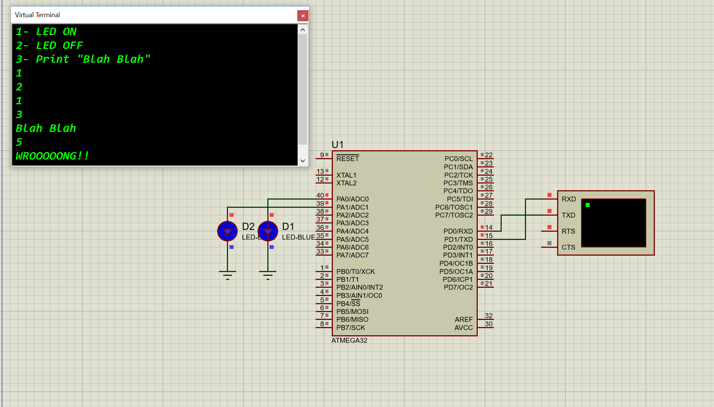

UART communication Protocol
=================

Introduction
------------
Universal asynchronous receiver-transmitter (UART) protocol implementation and testing it with some simple proteus simulation on Atmega32 with the AVR toolchain.

Hardware
--------
* USB Type A to Type B cable
* AVR ATmega32 microcontroller.

Circuit
--------

Installation
------------
You will need to have the AVR toolchain installed on your system. This includes:
* avr-gcc
* avr-libc
* avrdude

Support
------
Please feel free to contact me if you have any questions/concerns. My email address is hossamelbahrawy52@gmail.com
